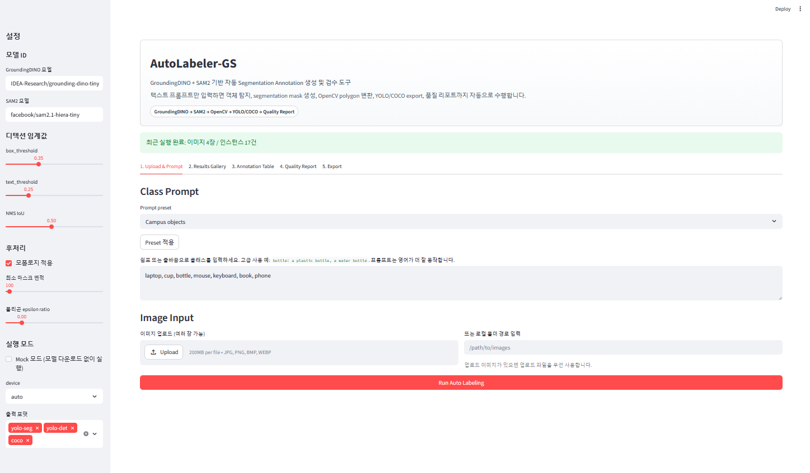
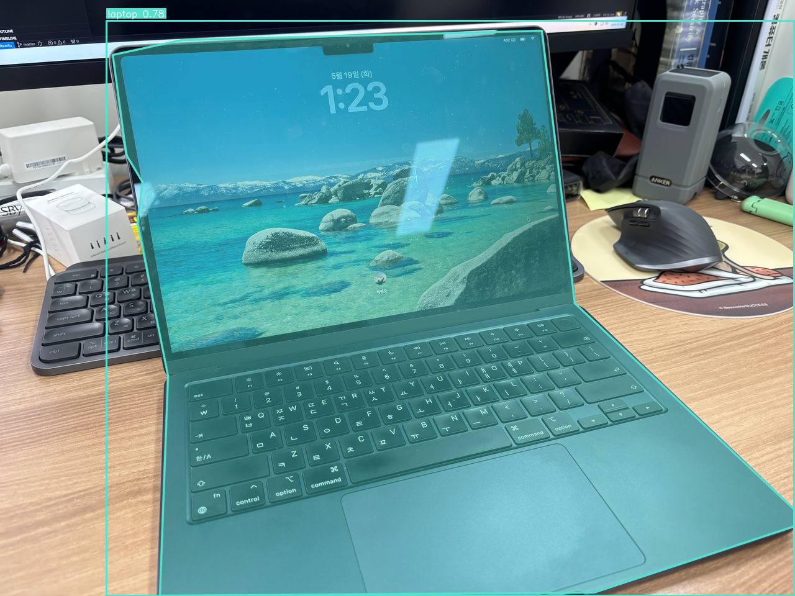
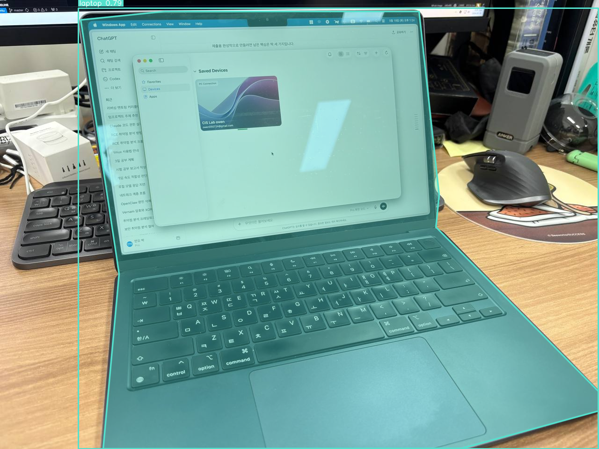
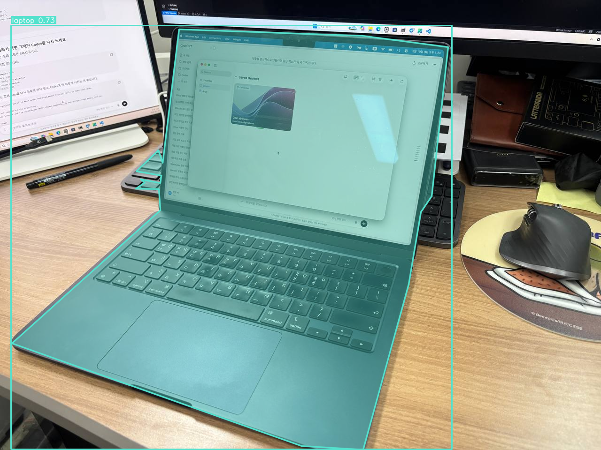
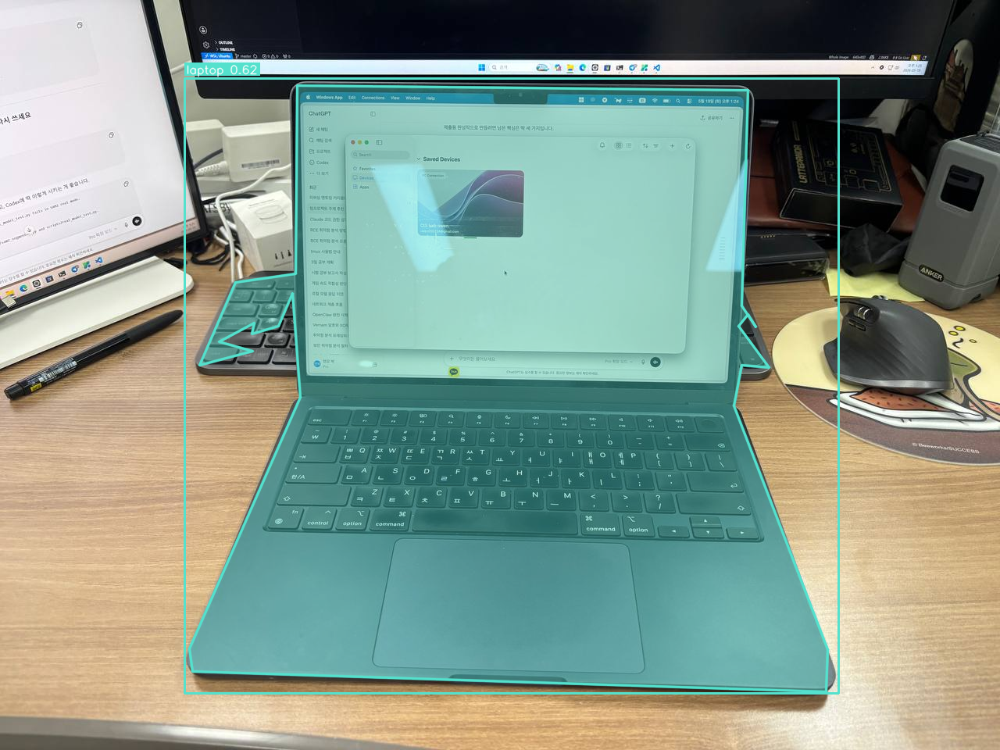
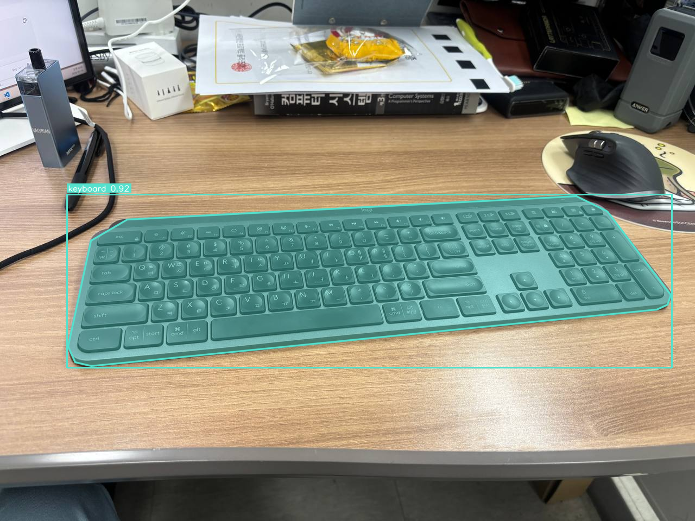
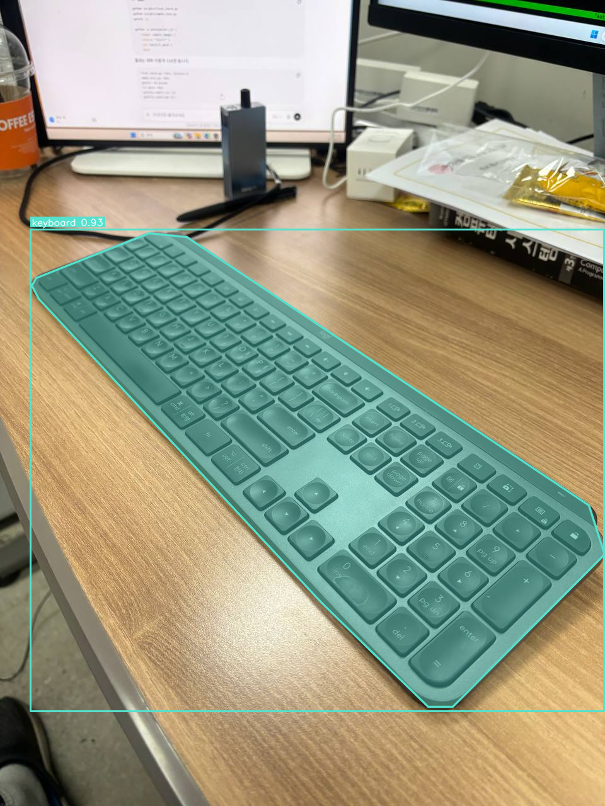
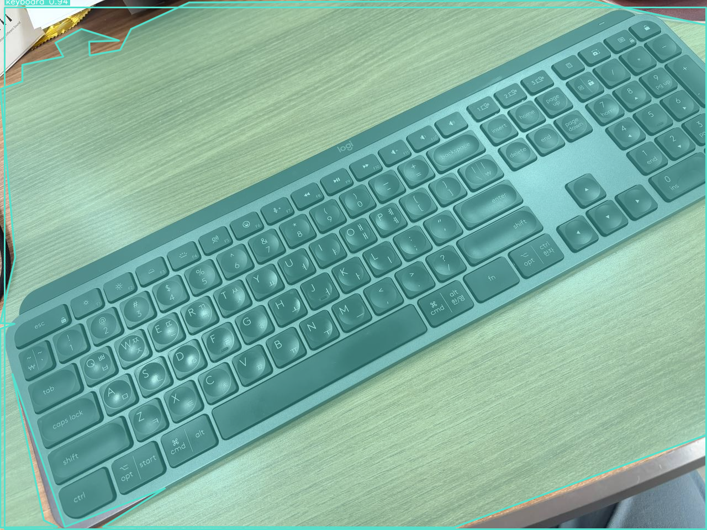
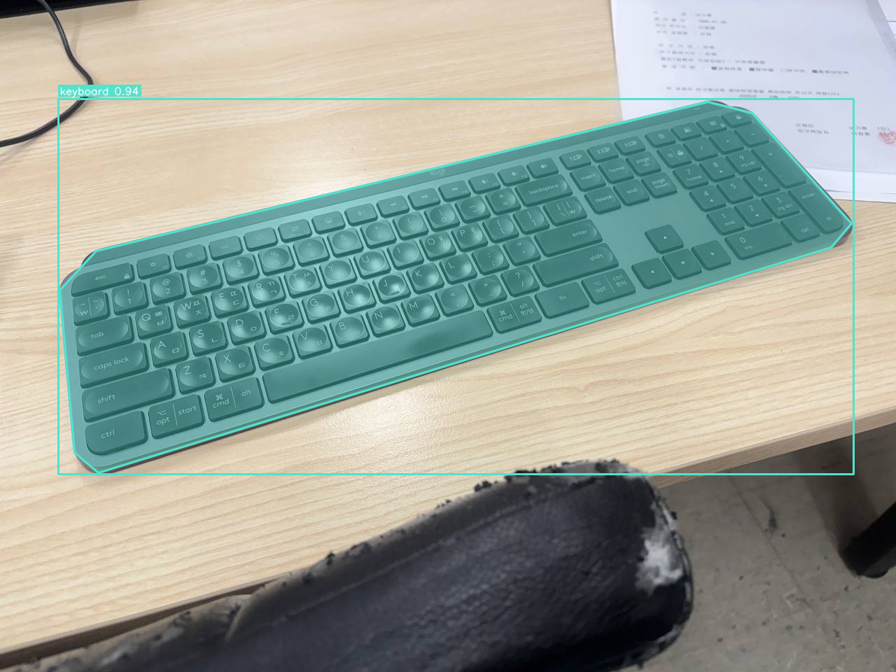

# AutoLabeler-GS

**AutoLabeler-GS: Automatic Dataset Labeling Tool with GroundingDINO + SAM2**

Python 기반 자동 데이터셋 라벨링 도구입니다.
사용자가 이미지와 텍스트 클래스 프롬프트를 입력하면 GroundingDINO가 객체 박스를
찾고, SAM2가 해당 박스를 프롬프트로 사용해 인스턴스 마스크를 생성합니다. 이후
OpenCV로 마스크를 정리하고 contour를 polygon으로 변환해 YOLO detection,
YOLO segmentation, COCO JSON 라벨과 preview overlay 이미지를 내보냅니다.

## 프로젝트 개요

객체 검출과 세그멘테이션 모델을 학습하려면 박스와 폴리곤 라벨이 필요합니다. 하지만
수백 장만 되어도 수작업 라벨링 비용이 커집니다. 이 프로젝트는 공개 foundation
model을 조합해 객체 위치와 segmentation polygon을 만들고, YOLO나 COCO 기반
transfer learning 데이터셋으로 바로 정리하는 것을 목표로 합니다.

## 알고리즘 개요

```text
Input images + text class prompts
        |
        v
GroundingDINO text-prompt object detection
        |
        v
SAM2 box-prompt segmentation
        |
        v
OpenCV mask cleanup
  - thresholding
  - cv2.morphologyEx
  - cv2.findContours
  - cv2.contourArea
  - cv2.approxPolyDP
        |
        v
Polygon conversion and coordinate normalization
        |
        v
YOLO det / YOLO seg / COCO export + preview overlays + ZIP
        |
        v
Streamlit GUI demo
```

이 프로젝트는 GroundingDINO를 텍스트 프롬프트 객체 검출기로 사용하고, SAM2를
박스 프롬프트 기반 세그멘테이션 모델로 사용합니다. OpenCV는 마스크 후처리,
contour 추출, polygon 단순화, RGB/BGR 변환, preview rendering에 사용됩니다.

## 강의 주제 연계

| 강의 주제 | 프로젝트 내 사용 위치 |
| --- | --- |
| OpenCV 이미지 표현 | `visualize.py`에서 PIL RGB 이미지를 OpenCV BGR 배열로 변환 |
| RGB/BGR 변환 | `cv2.cvtColor(rgb, cv2.COLOR_RGB2BGR)` |
| Thresholding | binary mask 변환, mock detector의 foreground 추정 |
| Morphology | `clean_mask()`의 open/close 연산 |
| Contour extraction | `cv2.findContours()`로 mask 외곽선 추출 |
| Polygon simplification | `cv2.approxPolyDP()`로 YOLO segmentation polygon 생성 |
| Segmentation | SAM2가 detection box마다 binary mask 생성 |
| Pixel coordinate system | `xyxy` 박스, polygon `x, y` 픽셀 좌표 처리 |
| Normalized YOLO coordinates | `class cx cy w h`, `class x1 y1 ...`를 `[0, 1]`로 정규화 |
| CNN / transfer learning workflow | 생성된 YOLO/COCO 라벨을 후속 학습 데이터로 사용 |
| Streamlit GUI | `app.py`에서 업로드, threshold 조정, preview, ZIP download 제공 |

## 실행 환경

Python 3.10 이상을 권장합니다.

```bash
git clone <repo-url> autolabeler-gs
cd autolabeler-gs

python3 -m venv .venv
source .venv/bin/activate
python -m pip install --upgrade pip
```

일반 GUI/mock 사용:

```bash
pip install -r requirements.txt
```

테스트 개발 환경:

```bash
pip install -r requirements-dev.txt
```

실제 GroundingDINO/SAM2 추론 환경:

```bash
pip install -r requirements-real.txt
```

GPU가 있으면 PyTorch는 본인 CUDA 버전에 맞는 wheel을 PyTorch 공식 설치 안내에
따라 먼저 설치하는 것을 권장합니다. CUDA를 강제하지 않으며 `--device auto`,
`--device cuda`, `--device cpu`를 지원합니다. GPU가 권장되지만 CPU fallback도
제공됩니다. CPU 실행은 매우 느릴 수 있습니다.

이 저장소는 모델 다운로드 없이 검증 가능한 mock mode와, 실제 GroundingDINO/SAM2
가중치를 내려받아 실행하는 real mode를 모두 제공합니다.

## Mock 모드

Mock 모드는 모델 다운로드 없이 파이프라인, OpenCV 후처리, exporter, Streamlit UI를
확인하기 위한 개발/테스트용 모드입니다. 외부 모델 환경 없이 CLI, Web UI, export
구조를 빠르게 확인할 수 있습니다.

```bash
python scripts/make_demo_assets.py

python -m autolabeler.cli \
  --images sample_images \
  --classes "object" \
  --out runs/cli_mock \
  --mock
```

Smoke test:

```bash
python scripts/smoke_test.py
```

## Real 모드

Real 모드는 GroundingDINO와 SAM2 모델을 실제로 다운로드하고 실행합니다.
GroundingDINO는 영어 prompt에서 대체로 더 안정적으로 동작하므로 `"person, bottle,
dog"`처럼 영어 명사를 입력하는 것을 권장합니다.

```bash
python -m autolabeler.cli \
  --images sample_images \
  --classes "person, bottle" \
  --out runs/real_test \
  --device auto
```

주요 옵션:

| 옵션 | 설명 |
| --- | --- |
| `--mock` | 실제 모델 대신 mock detector/segmenter 사용 |
| `--device {auto,cuda,cpu}` | 실행 장치 선택 |
| `--box-threshold` | GroundingDINO box confidence threshold |
| `--text-threshold` | GroundingDINO text matching threshold |
| `--nms-iou-threshold` | 클래스별 NMS IoU threshold |
| `--min-mask-area` | 너무 작은 mask contour 제거 |
| `--polygon-epsilon-ratio` | `approxPolyDP` epsilon 비율 |
| `--no-morphology` | OpenCV morphology 후처리 비활성화 |
| `--det-model-id` | GroundingDINO Hugging Face model id |
| `--sam-model-id` | SAM2 Hugging Face model id |
| `--formats` | `yolo-seg`, `yolo-det`, `coco` 중 선택 |

## 실제 모델 sanity check

한 장의 이미지로 실제 어댑터 연결을 확인하는 스크립트입니다. 샘플 이미지가 없으면
`sample_images/`에 실제 사진을 추가하라는 메시지를 출력합니다.

```bash
python scripts/real_model_test.py \
  --image sample_images/laptop_1.jpg \
  --classes "laptop" \
  --device auto \
  --box-threshold 0.30 \
  --text-threshold 0.20
```

출력 위치는 기본적으로 `runs/real_model_test/`입니다. 스크립트는 detection 수,
mask 수, accepted instance 수, preview 경로, output 경로, 사용 device를 출력합니다.
pytest에서는 실제 모델 다운로드를 요구하지 않습니다.
실제 모델 결과는 이 스크립트의 출력값을 기준으로 기록했습니다.

## Web UI / Streamlit 사용법

```bash
streamlit run app.py
```

명령 실행 후 브라우저에서 Streamlit이 안내하는 localhost 주소(예:
`http://localhost:8501`)를 열면 웹 UI를 사용할 수 있습니다. 이 UI는 단순 실행 버튼이
아니라 업로드, prompt 선택, 결과 검토, 품질 리포트 확인, ZIP 다운로드까지 한 화면에서
처리하는 localhost annotation tool입니다.

탭 구성:

1. `Upload & Prompt` 탭에서 prompt preset을 선택하거나 직접 class prompt를 입력합니다.
2. 같은 탭에서 이미지를 업로드하거나 로컬 이미지 폴더 경로를 입력합니다.
3. `Run Auto Labeling`을 눌러 mock mode 또는 real mode로 자동 라벨링을 실행합니다.
4. `Results Gallery`에서 preview overlay와 이미지별 instance 요약을 확인합니다.
5. `Annotation Table`에서 confidence filter와 class filter로 annotation을 검토합니다.
6. `Quality Report`에서 사람이 먼저 확인해야 할 HIGH priority annotation과 issue count를 확인합니다.
7. `Export`에서 생성된 `previews/`, YOLO/COCO 라벨, `quality_report.csv`,
   `quality_report.md`, ZIP 파일 상태를 확인하고 다운로드합니다.

Mock 모드는 모델 다운로드 없이 UI, exporter, OpenCV 후처리, 품질 리포트 흐름을
확인하는 모드입니다. Real 모드는 실제 GroundingDINO/SAM2 모델 가중치를 사용하므로
`requirements-real.txt`, torch/transformers 호환성, 모델 다운로드가 가능한 네트워크
환경이 필요합니다.



GUI 기능:

- Mock 모드와 real 모드 선택
- 여러 이미지 업로드
- 로컬 이미지 폴더 경로 입력
- prompt preset 선택
- 클래스 prompt text area
- box/text/NMS threshold slider
- morphology, 최소 면적, polygon epsilon 설정
- `runs/streamlit_YYYYMMDD_HHMMSS/` 아래 timestamped output 생성
- preview overlay gallery
- confidence 필터가 적용된 detection table
- Annotation Quality Report 표시
- 클래스별 요약 table (`class_name`, `count`, `average_score`)
- ZIP 다운로드
- `st.cache_resource`를 이용한 모델 캐싱

모델 ID, device, mock 모드가 바뀔 때만 heavy model을 다시 로드하도록 구성했습니다.
threshold나 후처리 슬라이더 변경은 기존 로드 모델을 재사용합니다.

## 라벨링 할 수 있는 대상

AutoLabeler-GS는 고정된 클래스만 분류하는 classifier가 아니라, 텍스트 프롬프트 기반
open-vocabulary detection + segmentation 도구입니다. 사용자가 입력한 영어 명사나 짧은
객체 설명을 GroundingDINO prompt로 사용하고, 검출된 box를 SAM2 segmentation prompt로
넘깁니다.

예시 prompt:

| Preset | Prompt examples |
| --- | --- |
| Desk objects | `laptop, cup, bottle, mouse, keyboard, book, phone` |
| Campus objects | `person, chair, desk, laptop, backpack, bottle` |
| Recycling objects | `plastic bottle, paper cup, can, cardboard box, plastic bag` |
| Basic objects | `person, dog, cat, bicycle, car, chair, bottle` |

영어 명사 prompt가 대체로 가장 안정적입니다. 아주 작은 객체, 가려진 객체, 반사/투명
물체, 배경과 색이 비슷한 물체, 특정 브랜드/모델처럼 지나치게 세부적인 prompt는 실패할
수 있습니다.

## 구현 포인트

AutoLabeler-GS는 모델 추론 결과를 그대로 보여주는 데서 끝나지 않고, 라벨 데이터셋으로
사용할 수 있는 형태까지 이어지도록 구성했습니다.

- OpenCV 기반 mask morphology
- contour extraction
- polygon simplification
- YOLO detection export
- YOLO segmentation export
- COCO JSON export
- Streamlit web UI
- Annotation Quality Analyzer
- Review Priority Report

특히 quality report는 confidence와 mask geometry를 사용해 확인 우선순위가 높은
annotation을 정리합니다. 이 과정 덕분에 detection, segmentation,
후처리, export, 결과 검토가 하나의 작업 흐름으로 연결됩니다.

## 출력 형식

CLI와 Streamlit 모두 다음 구조를 생성합니다.

```text
runs/<run_name>/
├─ previews/
│  └─ *_preview.png
├─ yolo_det/
│  ├─ data.yaml
│  ├─ images/
│  │  └─ 원본 이미지 복사본
│  └─ labels/
│     └─ *.txt
├─ yolo_seg/
│  ├─ data.yaml
│  ├─ images/
│  │  └─ 원본 이미지 복사본
│  └─ labels/
│     └─ *.txt
├─ coco/
│  └─ annotations.json
├─ quality_report.csv
├─ quality_report.md
└─ autolabeler_output.zip
```

YOLO detection:

```text
class_id x_center y_center width height
```

모든 좌표는 `[0, 1]` 범위로 정규화됩니다.

YOLO segmentation:

```text
class_id x1 y1 x2 y2 ... xn yn
```

polygon 좌표도 모두 `[0, 1]` 범위로 정규화됩니다.

YOLO exporter는 기본적으로 원본 이미지를 각 dataset 폴더의 `images/` 아래 복사합니다.
따라서 `yolo_det/data.yaml`과 `yolo_seg/data.yaml`의 `train: images`, `val: images`
경로를 바로 사용할 수 있습니다. 테스트용 synthetic result처럼 원본 파일 경로가 실제
파일이 아니면 이미지 복사는 건너뛰고 라벨만 생성됩니다.

생성되는 `data.yaml`은 export 폴더를 다른 위치로 옮겨도 사용할 수 있도록 상대 경로를
사용합니다.

```yaml
path: .
train: images
val: images
```

COCO JSON:

- 최상위 키: `images`, `annotations`, `categories`
- annotation 키: `id`, `image_id`, `category_id`, `bbox`, `area`,
  `segmentation`, `iscrowd`
- `pycocotools` 없이 JSON을 직접 생성합니다.

## Annotation Quality Analyzer

AutoLabeler-GS는 각 annotation에 대해 confidence와 기하학적 품질 지표를 계산합니다.
이 리포트는 낮은 confidence, 너무 작은 mask, 지나치게 큰 mask, bbox와 mask의 불균형처럼
확인이 필요한 결과를 먼저 보여주기 위한 용도입니다.

품질 분석은 GroundingDINO confidence, bbox 면적, OpenCV contour에서 만들어진 polygon
면적, bbox 대비 mask 면적 비율, polygon 점 수를 사용합니다. 결과는
`quality_report.csv`와 `quality_report.md`로 저장되며, ZIP 결과에도 함께 포함됩니다.
Streamlit UI에서도 같은 내용을 확인할 수 있습니다.

대표 issue flag:

- `LOW_CONFIDENCE`: detection confidence가 낮음
- `TINY_MASK`: 이미지 대비 mask 면적이 너무 작음
- `HUGE_MASK`: 이미지 대부분을 mask로 잡음
- `MASK_BOX_MISMATCH`: bbox 면적과 polygon 면적 비율이 부자연스러움
- `TOO_FEW_POLYGON_POINTS`: polygon 점 수가 너무 적음
- `TOO_MANY_POLYGON_POINTS`: polygon이 지나치게 복잡함

예시:

| image | class | score | priority | issues |
| --- | --- | ---: | --- | --- |
| laptop_1.jpg | laptop | 0.78 | LOW | - |
| desk_2.jpg | bottle | 0.31 | HIGH | LOW_CONFIDENCE |

## 데모 절차

```bash
python scripts/make_demo_assets.py
python scripts/smoke_test.py
pytest -q

python -m autolabeler.cli \
  --images sample_images \
  --classes "rectangle, circle" \
  --out runs/demo \
  --mock
```

real demo preview를 README assets로 복사하려면:

```bash
python scripts/copy_demo_previews.py \
  --source runs/real_demo/previews \
  --target assets/screenshots
```

이 스크립트는 선택한 preview 이미지를 `assets/screenshots/demo_preview_*.png` 형식으로
복사합니다. 보고서 구성에 맞춰 직접 캡처한 이미지를 추가하거나 파일명을 바꿔 사용해도
됩니다.

### 실제 모델 데모 결과

| Demo | Prompt | Images | Accepted instances | Notes |
| --- | --- | ---: | ---: | --- |
| Laptop | `laptop` | 4 | 4 | real-mode object segmentation |
| Keyboard | `keyboard` | 4 | 4 | includes one review-needed mask case |

실제 모델 데모는 직접 촬영한 노트북 이미지 4장을 `sample_images/laptop_*.jpg`로
저장한 뒤 실행했습니다. prompt는 `"laptop"`만 사용했고, 먼저 한 장으로
`real_model_test.py`를 실행해 GroundingDINO detection, SAM2 mask, OpenCV polygon
변환이 모두 이어지는지 확인했습니다.

```bash
python scripts/real_model_test.py \
  --image sample_images/laptop_1.jpg \
  --classes "laptop" \
  --device auto \
  --box-threshold 0.30 \
  --text-threshold 0.20
```

한 장 sanity check 결과는 detection 1건, mask 1건, accepted instance 1건이었습니다.
그 다음 전체 4장을 대상으로 threshold를 조정해 false positive를 줄인 설정을 사용했습니다.

```bash
python -m autolabeler.cli \
  --images sample_images \
  --classes "laptop" \
  --out runs/real_demo_t045 \
  --device auto \
  --box-threshold 0.45 \
  --text-threshold 0.30
```

최종 real demo 결과는 이미지 4장, accepted instance 4건이며 YOLO detection,
YOLO segmentation, COCO JSON, preview overlay, ZIP archive가 생성되었습니다.









### Keyboard 추가 real-mode 실험

키보드는 laptop에 이어 두 번째 real-mode 객체 카테고리로 추가했습니다. 같은 pipeline을
다른 물체에도 적용할 수 있는지 확인하기 위해 직접 촬영한 키보드 이미지 4장을
`sample_images/keyboard_*.jpg`로 저장하고 실행했습니다. 먼저 단일 이미지 sanity check를
수행했습니다.

```bash
python scripts/real_model_test.py \
  --image sample_images/keyboard_1.jpg \
  --classes "keyboard" \
  --device auto \
  --box-threshold 0.30 \
  --text-threshold 0.20
```

단일 이미지 결과는 detection 1건, mask 1건, accepted instance 1건이었습니다.
전체 keyboard 데모는 keyboard 이미지만 별도 입력 폴더로 묶어 실행했습니다.

```bash
mkdir -p /tmp/autolabeler_keyboard_input
cp sample_images/keyboard_*.jpg /tmp/autolabeler_keyboard_input/

python -m autolabeler.cli \
  --images /tmp/autolabeler_keyboard_input \
  --classes "keyboard" \
  --out runs/keyboard_demo \
  --device auto \
  --box-threshold 0.30 \
  --text-threshold 0.20
```

결과는 이미지 4장, accepted instance 4건이었고 `quality_report.md` 기준 평균
confidence는 0.931이었습니다. Review priority는 LOW 3건, MEDIUM 1건이며
HIGH priority annotation은 없었습니다. 이 결과는 AutoLabeler-GS가 laptop 하나에만
고정된 도구가 아니라 prompt 기반으로 다른 객체에도 적용될 수 있음을 보여줍니다.
다만 keyboard 이미지 중 한 사례는 mask가 주변 책상 영역을 일부 포함할 수 있어 검토가
필요합니다. 이런 경우를 빠르게 찾기 위해 Annotation Quality Analyzer와 Review Priority
Report를 함께 사용합니다.









YOLO segmentation label 예시:

```text
0 0.681250 0.051042 0.228125 0.066667 0.141406 0.091667 ...
```

## 실험 계획

1. Threshold 실험
   - `box_threshold`: 0.25, 0.35, 0.50
   - `text_threshold`: 0.15, 0.25, 0.40
   - 관찰 항목: 검출 수, false positive, missed object

2. 후처리 실험
   - morphology on/off
   - `polygon_epsilon_ratio`: 0.001, 0.003, 0.010
   - 관찰 항목: polygon 점 수, 경계 품질, tiny noise 제거 여부

3. Prompt 실험
   - `"bottle"` vs `"a plastic bottle"`처럼 일반명과 구체 prompt 비교
   - 영어 prompt와 한국어 prompt 비교

4. Downstream workflow
   - 생성된 YOLO 라벨을 Ultralytics YOLO 학습 데이터셋으로 사용
   - 자동 라벨만 사용한 결과와 사람이 검수한 라벨 결과 비교

## 한계와 주의사항

- 장면에 따라 결과 품질 차이가 있으므로 필요한 경우 라벨을 수정해 사용하는 것이 좋습니다.
- GroundingDINO는 영어 prompt가 보통 더 잘 동작합니다.
- 작은 객체, 가려진 객체, 유사한 배경에서는 검출/분할 품질이 떨어질 수 있습니다.
- SAM2는 class-aware 모델이 아니며, GroundingDINO box를 prompt로 받아 mask를 만듭니다.
- GPU가 권장되지만 CPU fallback이 있습니다. CPU에서는 속도가 매우 느릴 수 있습니다.
- 실제 모델 실행에는 torch, transformers, 모델 가중치 다운로드, 네트워크 연결이 필요합니다.

## 테스트

```bash
python scripts/smoke_test.py
pytest -q
python -m autolabeler.cli --images sample_images --classes "object" --out runs/cli_mock --mock
```

테스트는 실제 모델 다운로드를 요구하지 않도록 구성되어 있습니다.

## 참고 자료와 라이선스 메모

- GroundingDINO: https://github.com/IDEA-Research/GroundingDINO
- GroundingDINO paper: https://arxiv.org/abs/2303.05499
- SAM2: https://github.com/facebookresearch/sam2
- SAM2 paper/project: https://ai.meta.com/sam2/
- Hugging Face Transformers: https://huggingface.co/docs/transformers
- OpenCV: https://opencv.org/
- Streamlit: https://streamlit.io/
- PyTorch: https://pytorch.org/

이 저장소의 코드는 `LICENSE`에 따라 MIT License로 제공됩니다. GroundingDINO,
SAM2, Hugging Face 모델 가중치와 외부 코드는 각 원 프로젝트의 라이선스를 따릅니다.
